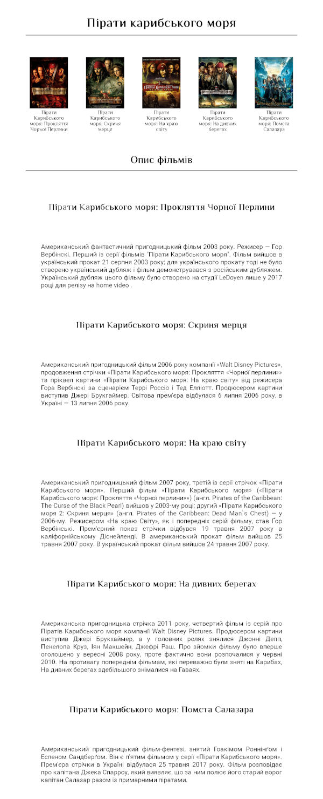

[ЗМІСТ](../index.md)

### Заняття №2

# Масиви та цикли


## **Цикли: `while` і `for`**

Цикли в JavaScript потрібні для виконання багаторазових завдань. Вони дозволяють вам автоматично повторювати блоки коду стільки разів, скільки необхідно, що особливо корисно для роботи з великими масивами даних або виконання однотипних операцій.

1. **Перебір елементів масиву**: Цикли дозволяють пройтися по всіх елементах масиву та виконати якусь дію для кожного з них.
2. **Зчитування даних**: Ви можете використовувати цикли для зчитування даних з різних джерел, наприклад, з файлів або користувацького вводу.
3. **Виконання повторюваних завдань**: Якщо вам потрібно виконати якусь операцію кілька разів, цикли допомагають зробити це без написання одного й того ж коду багато разів.

Існують різні типи циклів у JavaScript, такі як `for`, `while` та `do...while`, кожен з яких має свої переваги і підходить для різних задач.


### **Цикл while має такий синтаксис:**

```js
while (умова) {
  // код
  // так зване "тіло циклу"
}
```

Цикл `while` виконується, поки умова залишається істинною (`true`).  

```js
let i = 0;
while (i < 5) {
    console.log(i);
    i++;
}
```

- `i = 0` – початкове значення.  
- `i < 5` – умова перевіряється перед кожною ітерацією.  
- `i++` – після кожної ітерації змінна збільшується.  

**Цикл `do...while`** – особливий варіант `while`, де тіло виконується **мінімум один раз**:  
```js
let num = 0;
do {
    console.log(num);
    num++;
} while (num < 3);
```

### **Цикл `for`**  
Структура `for`:  
```js
for (ініціалізація; умова; зміна) {
    // Тіло циклу
}
```

Приклад:
```js
for (let i = 0; i < 5; i++) {
    console.log(i);
}
```

`for` часто використовують, коли заздалегідь відома кількість ітерацій.  


### **Вихід з циклу: `break` та `continue`**  
- `break` – **завершує** цикл достроково.  
- `continue` – **пропускає** одну ітерацію та переходить до наступної.  

```js
for (let i = 0; i < 10; i++) {
    if (i === 5) {
        break; // вихід з циклу при i = 5
    }
    console.log(i);
}
```
---

## **Конструкція `switch`**  
Конструкція `switch` замінює багаторазові `if-else` при порівнянні одного значення.  

**Приклад:**
```js
let day = 3;

switch (day) {
    case 1:
        console.log("Понеділок");
        break;
    case 2:
        console.log("Вівторок");
        break;
    case 3:
        console.log("Середа");
        break;
    default:
        console.log("Невідомий день");
}
```

- `case` перевіряє значення.  
- `break` припиняє виконання (без `break` код виконував би всі `case` нижче).  
- `default` виконується, якщо жоден `case` не підійшов.  

**Приклад без `break`:**
```js
let color = "red";

switch (color) {
    case "red":
        console.log("Червоний");
    case "blue":
        console.log("Синій");
    case "green":
        console.log("Зелений");
}
```

Усі `case` після першого відповідного виконаються через відсутність `break`.  

--- 

## Масиви 

Масиви в JavaScript є списками елементів, які зберігаються під одним іменем змінної. Кожен елемент має свій індекс, починаючи з 0.

```javascript
let fruits = ['apple', 'banana', 'cherry'];
console.log(fruits[0]); // 'apple'
```

### Основні Методи Масивів

**`push()`**: Додає один або більше елементів в кінець масиву.
   ```javascript
   let arr = [1, 2, 3];
   arr.push(4); // arr стає [1, 2, 3, 4]
   ```

**`pop()`**: Видаляє останній елемент з масиву і повертає його.
   ```javascript
   let arr = [1, 2, 3];
   let lastElement = arr.pop(); // arr стає [1, 2], lastElement = 3
   ```

**`shift()`**: Видаляє перший елемент з масиву і повертає його.
   ```javascript
   let arr = [1, 2, 3];
   let firstElement = arr.shift(); // arr стає [2, 3], firstElement = 1
   ```

**`unshift()`**: Додає один або більше елементів на початок масиву.
   ```javascript
   let arr = [1, 2, 3];
   arr.unshift(0); // arr стає [0, 1, 2, 3]
   ```

### Інтерація через Масиви

**`forEach()`**: Викликає вказану функцію один раз для кожного елемента масиву.
   ```javascript
   let arr = [1, 2, 3];
   arr.forEach(x => console.log(x)); // Виведе 1, 2, 3 в консоль
   ```

**`map()`**: Створює новий масив з результатами виклику функції для кожного елемента масиву.
   ```javascript
   let arr = [1, 2, 3];
   let mappedArr = arr.map(x => x * 2); // mappedArr стає [2, 4, 6]
   ```

**`filter()`**: Створює новий масив з елементами, які відповідають умовам вказаної функції.
   ```javascript
   let arr = [1, 2, 3, 4];
   let filteredArr = arr.filter(x => x > 2); // filteredArr стає [3, 4]
   ```

### Зведення Даних

**`reduce()`**: Застосовує функцію до кожного елемента масиву (зліва направо), збираючи результат в одне значення.
   ```javascript
   let arr = [1, 2, 3, 4];
   let sum = arr.reduce((acc, x) => acc + x, 0); // sum стає 10
   ```

### Пошук в Масиві

**`find()`**: Повертає перший елемент масиву, який відповідає умовам вказаної функції.
   ```javascript
   let arr = [1, 2, 3, 4];
   let found = arr.find(x => x > 2); // found стає 3
   ```

**`findIndex()`**: Повертає індекс першого елемента масиву, який відповідає умовам вказаної функції.
    ```javascript
    let arr = [1, 2, 3, 4];
    let index = arr.findIndex(x => x > 2); // index стає 2
    ```

---

# Завдання 

Створити веб-сторінку, яка відображає інформацію про фільми серії "Пірати Карибського моря".

**Структура файлів:**

1.  **index.html:** Головний HTML-файл.
2.  **style.css:** Файл зі стилями CSS.
3.  **script.js:** Файл з кодом JavaScript.


**JavaScript (script.js):**

*   Описати масив `movies` з інформацією про фільми (назва, зображення, опис).
*   Реалізувати вибір теми користувачем за допомогою `prompt` та `alert`.
*   Забезпечити збереження обраної теми (темна або світла) у змінній `selectedStyle`.
*   Створити HTML-розмітку для header та section, використовуючи дані з масиву `movies`.
*   Динамічно додавати створену розмітку на сторінку, використовуючи `document.body.innerHTML`.



---

[Домашнє завдання](task.md)
