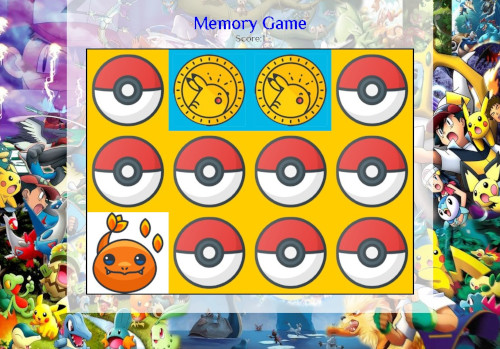

[ЗМІСТ](../index.md)

### Заняття №5

# Об'єктна модель документа

**Document Object Model (DOM)** — це програмний інтерфейс для веб-документів. Він представляє сторінку як структуру об’єктів, до яких можна отримати доступ і маніпулювати за допомогою мови програмування, наприклад, JavaScript.

### **Що таке DOM?**
- DOM описує HTML або XML-документ як дерево вузлів (*nodes*).
- Кожен елемент сторінки (теги, текст, атрибути) є вузлом дерева.
- DOM дозволяє динамічно змінювати вміст, структуру та стиль документа.

**Приклад:**
HTML-код:
```html
<!DOCTYPE html>
<html>
  <body>
    <h1>Привіт, світ!</h1>
    <p>Це абзац.</p>
  </body>
</html>
```

Структура DOM:
```
html
 └── body
      ├── h1
      │    └── Текст: "Привіт, світ!"
      └── p
           └── Текст: "Це абзац."
```

### **Взаємодія з DOM за допомогою JavaScript**

#### **Доступ до елементів**
JavaScript дозволяє знаходити елементи на сторінці за допомогою спеціальних методів.

1. **`getElementById`** — знаходить елемент за його `id`:
```javascript
const header = document.getElementById('header');
console.log(header);
```

2. **`querySelector`** — універсальний метод для вибору елемента за CSS-селектором:
```javascript
const paragraph = document.querySelector('p'); // Перший абзац
console.log(paragraph);
```

3. **`querySelectorAll`** — знаходить усі елементи, що відповідають селектору:
```javascript
const paragraphs = document.querySelectorAll('p'); // Усі абзаци
console.log(paragraphs);
```

#### **Зміна контенту**
DOM дозволяє динамічно змінювати текст або HTML всередині елемента.

1. **Заміна тексту:**
```javascript
const header = document.getElementById('header');
header.textContent = 'Привіт з JavaScript!';
```

2. **Додавання HTML:**
```javascript
const content = document.querySelector('.content');
content.innerHTML = '<strong>Новий текст із тегом</strong>';
```

#### **Зміна атрибутів**
Можна змінювати атрибути елементів, такі як `src`, `href`, `class`, та інші.
```javascript
const img = document.querySelector('img');
img.src = 'new-image.png'; // Змінюємо шлях до зображення
img.alt = 'Новий опис'; // Додаємо текстову альтернативу
```

#### **Стилізація елементів**
DOM дозволяє змінювати CSS-стилі прямо з JavaScript.

1. **Зміна стилів:**
```javascript
const header = document.querySelector('h1');
header.style.color = 'blue'; // Змінюємо колір тексту
header.style.fontSize = '24px'; // Розмір шрифту
```

2. **Додавання/видалення класів:**
```javascript
const header = document.querySelector('h1');
header.classList.add('highlight'); // Додати клас
header.classList.remove('highlight'); // Видалити клас
header.classList.toggle('hidden'); // Перемкнути наявність класу
```

### **Створення і видалення елементів**

#### **Створення елементів**
DOM дозволяє створювати нові вузли для додавання їх на сторінку.
```javascript
const newDiv = document.createElement('div'); // Створюємо елемент
newDiv.textContent = 'Це новий елемент!';
document.body.appendChild(newDiv); // Додаємо елемент у документ
```

#### **Видалення елементів**
```javascript
const paragraph = document.querySelector('p');
paragraph.remove(); // Видаляємо елемент зі сторінки
```

---

### **Обробка подій у DOM**

#### **Що таке подія?**
Події в DOM — це дії, що відбуваються на сторінці (наприклад, натискання кнопки, введення тексту, завантаження сторінки).

#### **Додавання обробника подій**
1. **Через атрибут HTML:**
```html
<button onclick="alert('Кнопка натиснута!')">Клік</button>
```

2. **Через метод `addEventListener`:**
```javascript
const button = document.querySelector('button');
button.addEventListener('click', () => {
  alert('Кнопка натиснута!');
});
```


### **Перебір DOM-елементів**

1. **Доступ до дітей вузла:**
```javascript
const list = document.querySelector('ul');
console.log(list.children); // Отримати всіх дочірніх елементів
```

2. **Доступ до батьківського вузла:**
```javascript
const item = document.querySelector('li');
console.log(item.parentElement); // Отримати батьківський елемент
```

3. **Доступ до сусідів:**
```javascript
const item = document.querySelector('li');
console.log(item.nextElementSibling); // Наступний елемент
console.log(item.previousElementSibling); // Попередній елемент
```

---

# Завдання

**Memory Game**




Правила гри

- Переверніть 2 картки рубашкою донизу.
- Якщо на карточках однакові зображення, то карточки прибираються зі столу.
- Якщо на карточках різні зображення, то карточки перевертаються рубашкою доверху.
- Якщо карточки ще лишились повторіть всі дії, починаючи з першого кроку, в іншому випадку - гра завершена.