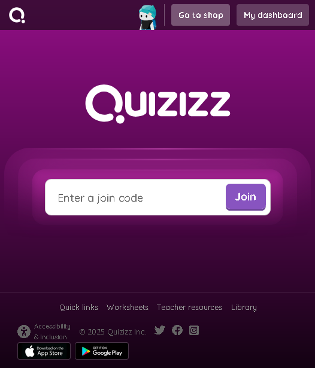

[ЗМІСТ](../index.md)

### Заняття №8

# Тестування

# Практика

## Гра: "Хрестики нулики"

### Структура HTML
- Адаптивне ігрове поле з сіткою 3х3
- Індикатор стану, що показує чий хід або результат гри
- Кнопка перезавантаження для початку нової гри

### Код JavaScript відповідає за всю ігрову логіку:

1. **Управління станом гри**:
   - Відстежує поточного гравця (X або O)
   - Зберігає стан дошки у масиві
   - Перевіряє активний/завершений стан гри

2. **Обробка подій**:
   - Реагує на кліки гравця на клітинках дошки
   - Керує функціоналом кнопки скидання

3. **Ігрова логіка**:
   - Запобігає грі на вже заповнених клітинах
   - Перемикається між гравцями після кожного правильного ходу
   - Перевіряє наявність виграшних комбінацій після кожного ходу
   - Визначає, коли гра закінчується в нічию
   - Підсвічує виграшні комбінації

