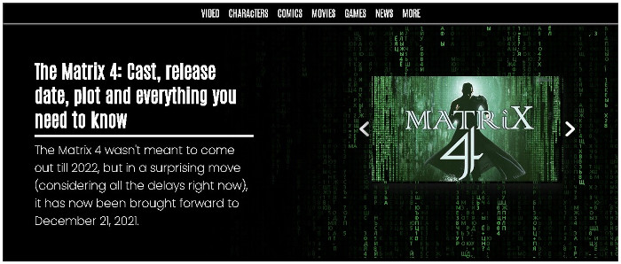

[ЗМІСТ](../index.md)

### Заняття № 9

# Canvas в HTML5

Canvas - це елемент HTML5, який використовується для малювання графіки, створення анімацій, діаграм, візуалізацій даних, ігор та інших інтерактивних елементів у веб-браузері через JavaScript. 


- https://alteredqualia.com/
- http://multeor.com/game/
- http://www.thewildernessdowntown.com/


## Створення Canvas елементу

Для створення Canvas елементу в HTML-документі використовується тег `<canvas>`:

```html
<canvas id="myCanvas" width="600" height="400"></canvas>
```

Атрибути:
- `id` - унікальний ідентифікатор для доступу через JavaScript
- `width` - ширина полотна в пікселях
- `height` - висота полотна в пікселях

## Отримання контексту

Для малювання на Canvas спочатку потрібно отримати контекст малювання через JavaScript:

```javascript
const canvas = document.getElementById('myCanvas');
const ctx = canvas.getContext('2d');
```

Метод `getContext()` має такі параметри:
- `'2d'` - для двовимірної графіки (найпоширеніший)
- `'webgl'` або `'experimental-webgl'` - для 3D графіки
- `'webgl2'` - для WebGL 2.0
- `'bitmaprenderer'` - для відображення вмісту ImageBitmap

## Основні функції малювання

### Фігури

#### 1. Прямокутники

```javascript
// Заповнений прямокутник
ctx.fillRect(x, y, width, height);

// Контур прямокутника
ctx.strokeRect(x, y, width, height);

// Очищення прямокутної області
ctx.clearRect(x, y, width, height);
```

Параметри:
- `x`, `y` - координати верхнього лівого кута
- `width`, `height` - ширина та висота прямокутника

#### 2. Шляхи (Paths)

```javascript
// Початок нового шляху
ctx.beginPath();

// Переміщення "пера" в точку
ctx.moveTo(x, y);

// Малювання лінії до вказаної точки
ctx.lineTo(x, y);

// Малювання дуги/кривої
ctx.arc(x, y, radius, startAngle, endAngle, anticlockwise);

// Малювання кривої Безьє другого порядку
ctx.quadraticCurveTo(cpx, cpy, x, y);

// Малювання кривої Безьє третього порядку
ctx.bezierCurveTo(cp1x, cp1y, cp2x, cp2y, x, y);

// Закриття шляху (з'єднання з початковою точкою)
ctx.closePath();

// Заливка шляху
ctx.fill();

// Промальовування контуру шляху
ctx.stroke();
```

Параметри для `arc()`:
- `x`, `y` - координати центру кола
- `radius` - радіус кола
- `startAngle`, `endAngle` - початковий і кінцевий кути в радіанах
- `anticlockwise` - напрямок малювання (за замовчуванням `false` - за годинниковою стрілкою)

Параметри для `quadraticCurveTo()`:
- `cpx`, `cpy` - координати контрольної точки
- `x`, `y` - координати кінцевої точки

Параметри для `bezierCurveTo()`:
- `cp1x`, `cp1y` - координати першої контрольної точки
- `cp2x`, `cp2y` - координати другої контрольної точки
- `x`, `y` - координати кінцевої точки

### Стилі та кольори

```javascript
// Колір заливки
ctx.fillStyle = 'red'; // або 'rgb(255,0,0)' або '#FF0000'

// Колір обводки
ctx.strokeStyle = 'blue';

// Прозорість
ctx.globalAlpha = 0.5; // значення від 0.0 (прозорий) до 1.0 (непрозорий)

// Товщина лінії
ctx.lineWidth = 5;

// Стиль кінця лінії
ctx.lineCap = 'round'; // 'butt', 'round' або 'square'

// Стиль з'єднання ліній
ctx.lineJoin = 'miter'; // 'bevel', 'round' або 'miter'

// Межа гострих кутів з'єднання
ctx.miterLimit = 10;

// Тіні
ctx.shadowOffsetX = 5;
ctx.shadowOffsetY = 5;
ctx.shadowBlur = 4;
ctx.shadowColor = 'rgba(0, 0, 0, 0.5)';
```

### Текст

```javascript
// Малювання заповненого тексту
ctx.fillText(text, x, y, maxWidth);

// Малювання тексту контуром
ctx.strokeText(text, x, y, maxWidth);

// Налаштування шрифту
ctx.font = 'italic bold 24px Arial';

// Горизонтальне вирівнювання тексту
ctx.textAlign = 'center'; // 'start', 'end', 'left', 'right' або 'center'

// Вертикальне вирівнювання тексту
ctx.textBaseline = 'middle'; // 'top', 'hanging', 'middle', 'alphabetic', 'ideographic', 'bottom'

// Напрямок тексту
ctx.direction = 'ltr'; // 'ltr' (зліва направо) або 'rtl' (справа наліво)
```

Параметри для `fillText()` та `strokeText()`:
- `text` - текст для малювання
- `x`, `y` - координати точки розміщення тексту
- `maxWidth` - (опціонально) максимальна ширина тексту

### Зображення

```javascript
// Малювання зображення
ctx.drawImage(image, dx, dy);
ctx.drawImage(image, dx, dy, dWidth, dHeight);
ctx.drawImage(image, sx, sy, sWidth, sHeight, dx, dy, dWidth, dHeight);
```

Параметри:
- `image` - об'єкт зображення (Image, Canvas, Video)
- `sx`, `sy` - координати вихідного прямокутника у вихідному зображенні
- `sWidth`, `sHeight` - розміри вихідного прямокутника
- `dx`, `dy` - координати цільового прямокутника на Canvas
- `dWidth`, `dHeight` - розміри цільового прямокутника

### Трансформації

```javascript
// Переміщення початку координат
ctx.translate(x, y);

// Поворот (в радіанах)
ctx.rotate(angle);

// Масштабування
ctx.scale(scaleX, scaleY);

// Трансформація матрицею
ctx.transform(a, b, c, d, e, f);
ctx.setTransform(a, b, c, d, e, f);
ctx.resetTransform();
```

Параметри для `transform()` та `setTransform()`:
- `a` - горизонтальне масштабування
- `b` - горизонтальний зсув
- `c` - вертикальний зсув
- `d` - вертикальне масштабування
- `e` - горизонтальне зміщення
- `f` - вертикальне зміщення

### Робота зі станом Canvas

```javascript
// Збереження поточного стану canvas
ctx.save();

// Відновлення останнього збереженого стану
ctx.restore();
```

### Композиція

```javascript
ctx.globalCompositeOperation = 'source-over';
```

Деякі можливі значення `globalCompositeOperation`:
- `'source-over'` (за замовчуванням) - нова фігура малюється поверх існуючого вмісту
- `'source-in'` - малюється лише перетин нової фігури з існуючим вмістом
- `'source-out'` - малюється лише та частина нової фігури, яка не перетинається з існуючим вмістом
- `'source-atop'` - нова фігура малюється лише на існуючому вмісті


### Градієнти та патерни

```javascript
// Лінійний градієнт
const linearGradient = ctx.createLinearGradient(x0, y0, x1, y1);
linearGradient.addColorStop(0, 'white');
linearGradient.addColorStop(1, 'black');

// Радіальний градієнт
const radialGradient = ctx.createRadialGradient(x0, y0, r0, x1, y1, r1);
radialGradient.addColorStop(0, 'white');
radialGradient.addColorStop(1, 'black');

// Використання градієнта
ctx.fillStyle = linearGradient;
ctx.strokeStyle = radialGradient;

// Створення патерну
const img = document.getElementById('myImage');
const pattern = ctx.createPattern(img, 'repeat');
ctx.fillStyle = pattern;
```

Параметри для `createLinearGradient()`:
- `x0`, `y0` - координати початкової точки
- `x1`, `y1` - координати кінцевої точки

Параметри для `createRadialGradient()`:
- `x0`, `y0` - координати центру початкового круга
- `r0` - радіус початкового круга
- `x1`, `y1` - координати центру кінцевого круга
- `r1` - радіус кінцевого круга

Параметри для `createPattern()`:
- `image` - об'єкт зображення
- `repetition` - тип повторення: `'repeat'`, `'repeat-x'`, `'repeat-y'`, `'no-repeat'`

### Пікселі та маніпуляції з ними

```javascript
// Отримання даних про пікселі
const imageData = ctx.getImageData(sx, sy, sw, sh);

// Створення нового об'єкта ImageData
const newImageData = ctx.createImageData(width, height);
const newImageDataCopy = ctx.createImageData(anotherImageData);

// Розміщення даних про пікселі на canvas
ctx.putImageData(imageData, dx, dy);
ctx.putImageData(imageData, dx, dy, dirtyX, dirtyY, dirtyWidth, dirtyHeight);
```

Параметри для `getImageData()`:
- `sx`, `sy` - координати верхнього лівого кута прямокутника, з якого отримуються дані
- `sw`, `sh` - ширина та висота прямокутника

Параметри для `putImageData()`:
- `imageData` - об'єкт ImageData
- `dx`, `dy` - координати, де розмістити дані зображення
- `dirtyX`, `dirtyY`, `dirtyWidth`, `dirtyHeight` - (опціонально) прямокутник, який потрібно намалювати

## Анімація з Canvas

Приклад простої анімації:

```javascript
const canvas = document.getElementById('myCanvas');
const ctx = canvas.getContext('2d');
let x = 0;

function animate() {
  // Очистка canvas
  ctx.clearRect(0, 0, canvas.width, canvas.height);
  
  // Малювання об'єкта
  ctx.fillStyle = 'blue';
  ctx.fillRect(x, 50, 50, 50);
  
  // Оновлення позиції
  x = (x + 2) % canvas.width;
  
  // Наступний кадр
  requestAnimationFrame(animate);
}

// Запуск анімації
animate();
```

Функції для анімації:
- `requestAnimationFrame(callback)` - планує виконання функції callback перед наступним перемалюванням браузера
- `cancelAnimationFrame(requestID)` - скасовує запланований кадр анімації

---

# Завдання

**Matrix**



Необхідно створити веб-сторінку на основі HTML-коду, яка містить **навігаційне меню, заголовки, графічні елементи та інтерактивні компоненти**.  


**Структура сторінки**  
- Використати семантичні теги (`<header>`, `<nav>`, `<div>`, `<canvas>`).  
- Додати заголовки `<h2>` для основної інформації.  

**Навігація**  
- Реалізувати меню (`<ul>` із `<li>`), яке містить розділи **VIDEO, CHARACTERS, COMICS, MOVIES, GAMES, NEWS, MORE**.  

**Робота з `<canvas>`**  
- Створити два `<canvas>` елементи (`canvas1` та `canvas2`).  
- Використати JavaScript (`javacod.js`) для відображення графіки або анімації на цих канвасах.  

**Динамічні елементи**  
- Додати **слайдер із зображеннями** (`left-arrow.png`, `right-arrow.png`).  
- Зробити так, щоб кнопки **переміщували слайди** за допомогою JS.  

**Оформлення (CSS)**  
- Підключити **CSS-файл (`style.css`)** для стилізації сторінки.  
- Використати **позиціонування (`absolute`)** для розташування елементів.  
