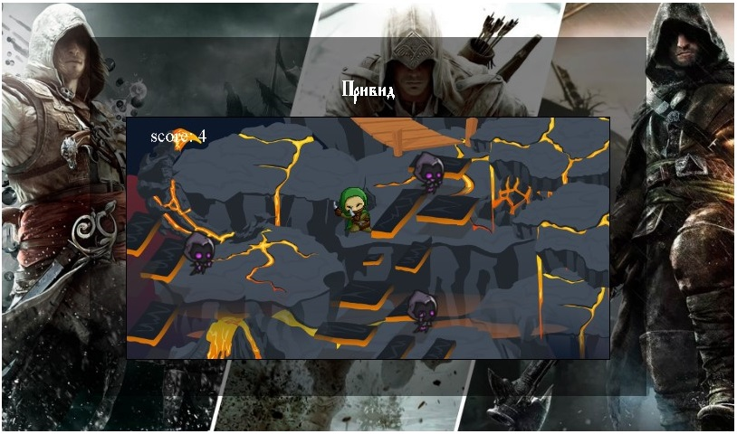

[ЗМІСТ](../index.md)

### Заняття № 10-12

# Класи

Класи в JavaScript з'явились у стандарті ES6 (ECMAScript 2015) і являють собою синтаксичний цукор над вже існуючим прототипним наслідуванням. Вони надають більш зрозумілий та чистий спосіб створення об'єктів та організації наслідування порівняно з функціями-конструкторами та прототипами.

Класи дозволяють нам:
- Організувати код більш структуровано
- Використовувати наслідування більш інтуїтивно
- Застосовувати ООП (Об'єктно-орієнтоване програмування) концепції більш чітко

Важливо розуміти, що під капотом JavaScript все ще використовує прототипне наслідування, а класи є лише синтаксичним удосконаленням.

### [Синтаксис класів &#8680;](class.md)

 

---

## Завдання: "Мисливець за привидами"

### Опис та мета проекту
Розробити інтерактивну 2D браузерну гру, де користувач контролює персонажа-мисливця, що полює на привидів. Гравець повинен керувати персонажем за допомогою вказівника миші, переміщуючись по ігровому полю та "ловлячи" привидів, які з'являються знизу екрану і рухаються вгору.

### Функціональні вимоги

#### Ігрове поле:
1. Створити HTML-сторінку з елементом canvas розміром, який буде визначено в коді
2. Задати фонове зображення карти для ігрового поля
3. Відображати поточний рахунок у верхньому лівому куті екрану

#### Керування гравцем:
1. Реалізувати керування персонажем за допомогою вказівника миші
2. Персонаж повинен плавно рухатися до позиції курсора миші
3. Реалізувати різні стани анімації персонажа:
   - Стан спокою (коли персонаж стоїть на місці)
   - Біг вліво (коли персонаж рухається вліво)
   - Біг вправо (коли персонаж рухається вправо)

#### Привиди:
1. Створити систему періодичної генерації привидів знизу екрану
2. Привиди повинні з'являтися у випадкових горизонтальних позиціях
3. Реалізувати анімацію руху привидів
4. Забезпечити різну швидкість руху для різних привидів

#### Механіка гри:
1. Реалізувати систему підрахунку очок: за кожного спійманого привида гравець отримує 1 очко
2. Реалізувати перевірку зіткнень між гравцем та привидами
3. При зіткненні гравця з привидом, привид має зникати та нараховуватись очко
4. Привиди, які вийшли за верхню межу екрану, повинні видалятися з гри

#### Графіка та анімація:
1. Використати спрайтові зображення для персонажа у різних станах
2. Реалізувати покадрову анімацію руху персонажа та привидів
3. Забезпечити плавність анімації

### Технічні вимоги:
1. Використати чистий JavaScript (без додаткових фреймворків)
2. Використати HTML5 Canvas для відображення гри
3. Організувати код у класи для кращої структури та підтримки
4. Забезпечити ефективне управління ресурсами (видалення непотрібних об'єктів)
5. Оптимізувати продуктивність для плавності гри (використання requestAnimationFrame)

### Структура проекту:
1. Створити файл HTML з елементом canvas
2. Створити каталог "images/" для зберігання графічних ресурсів гри
3. Забезпечити усі необхідні зображення:
   - Фон карти (map01_preview-01.png)
   - Спрайти гравця (idle_hero.png, run_left.png, run_right.png)
   - Спрайти привидів (ghostRight.png)

 

