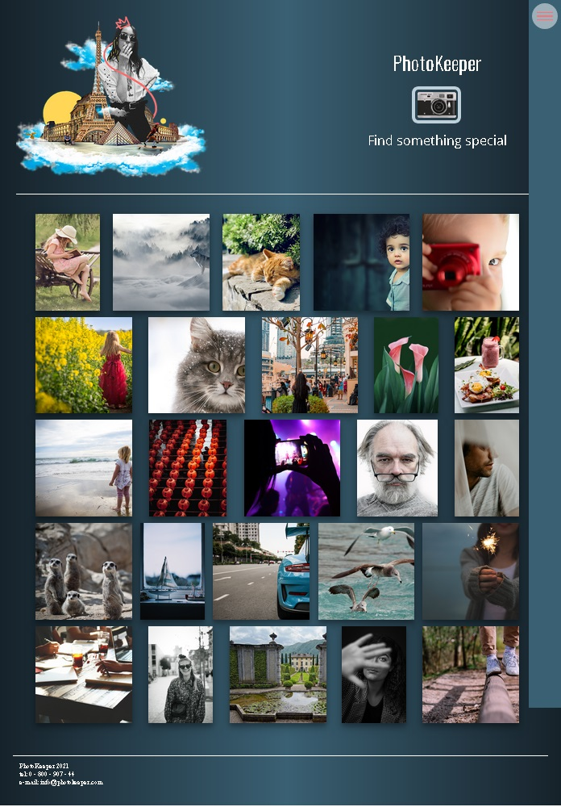

[ЗМІСТ](../index.md)

### Заняття № 13-15

Flask - це мікрофреймворк, він надає велику свободу у визначенні структури файлів вашого проекту. Однак, існують загальноприйняті "найкращі практики", які допомагають зробити проект більш організованим, підтримуваним та масштабованим.

Нагадаємо типову структуру файлів для проекту Flask, яка добре підходить для невеликих додатків:

```
my_flask_project/
│
├── config.py
├── models.py
├── routes.py
├── static/
│   ├── css/
│   ├── js/
│   └── img/
├── templates/
│   ├── base.html
│   ├── index.html
│   └── users/
│       └── profile.html
├── venv/ (або .venv/, .env/ - віртуальне середовище Python)
├── README.md
└── .gitignore
```

**Каталог проекту (`my_flask_project/`):**

**`config.py`**: Містить конфігураційні налаштування для вашого додатка (наприклад, налаштування бази даних, секретні ключі, режими розробки/виробництва). Краще використовувати різні конфігураційні класи для різних середовищ (розробка, тестування, продакшн).

**`models.py`**: Визначає моделі даних (якщо ви використовуєте ORM, наприклад, SQLAlchemy). Це представляє структуру ваших даних у базі даних.

**`routes.py`**: Містить функції перегляду (view functions), які обробляють HTTP-запити та повертають HTTP-відповіді. Це ті функції, що пов'язані з URL-маршрутами.

**`static/`**: Містить статичні файли, такі як CSS, JavaScript, зображення. Flask автоматично шукає ці файли в цьому каталозі.
  * `css/`
  * `js/`
  * `img/`

**`templates/`**: Містить HTML-шаблони Jinja2. Flask автоматично шукає шаблони в цьому каталозі. Можна мати загальні шаблони (наприклад, `base.html`) і шаблони, специфічні для певних модулів (наприклад, `auth/login.html`).

**`venv/` (або інша назва віртуального середовища, наприклад, `.venv`, `.env`)**: Це каталог, де зберігається ваше віртуальне середовище Python. Він містить ізольовані пакети та інтерпретатор Python для вашого проекту, щоб уникнути конфліктів залежностей. **Важливо: цей каталог завжди повинен бути доданий до `.gitignore`\!**

**`README.md`**: Файл, що містить опис вашого проекту, інструкції з встановлення, використання та розгортання.

**`.gitignore`**: Файл, який вказує Git, які файли та каталоги ігнорувати (наприклад, `venv/`, `.env`, файли кешу).

---

# Завдання

### Створення веб-додатку PhotoKeeper

Вам потрібно створити веб-додаток **PhotoKeeper** - соціальну платформу для обміну фотографіями. Додаток дозволяє користувачам переглядати галерею фото, відкривати їх у повноекранному режимі, читати коментарі та завантажувати власні зображення.



### Header (Шапка сайту)
Створіть header з наступними елементами:
  - Home
  - About  
  - Favorites
  - Settings

Основний контент header:

- Заголовок h1: **PhotoKeeper**
- Форма завантаження файлів:
- Підпис: **Find something special**

### Main (Основний контент)

Контейнер для фотографій

Секція перегляду фото:

- Контейнер 
- Зображення для закриття
- Зображення для перегляду 
- Контейнер для опису та статистики
- Контейнер для коментарів 

### Footer (Підвал)
Додайте контактну інформацію:
- PhotoKeeper 2021
- tel: 0 - 800 - 907 - 44
- e-mail: info@photokeeper.com

### Шаблони (Templates)
Створіть два template елементи

- Шаблон фотографії 
- Шаблон коментаря 

## Функціональність JavaScript

#### Мобільне меню
Реалізувати розкриття/закриття мобільного меню

#### Генерація даних для фотографій
Створити масив об'єктів з даними фотографій

**Масиви для генерації:**
```javascript
[
    'Цей кадр нереально крутий! :)',
    'Ти вмієш дивувати! Кожен кадр - поєднання життєлюбності і краси',
    'Спинися мить, прекрасна ти!',
    'Просто супер! Як тобі це вдається?',
    'Це просто шедевр мистецтва',
    'В цьому штучному світі так приємно знайти щось натуральне))',
    'Клас!!!))',
    'Нереально чудово!',
    'А ти вмієш дивувати ;)',
    'Це фото так і проситься в рамочку на стіну'
];

[
    'Коли радості немає меж',
    'Любов в кожному пікселі',
    'Фото заряджене позитивом',
    'Зловив дзен',
    'Як мало потрібно для щастя',
    'Знали б ви що в мене на умі! ;)',
    'Show must go on',
    'Good vibes only',
    'My inspiration',
    'On my way to paradise',
    'Що це, якщо не любов? Х)'
];
```

**Структура об'єкта фотографії:**
```javascript
{
    src: '../static/img/photos/0.jpg',
    likes: 150,
    effect: 'none',
    description: 'Опис фото',
    comments: ['коментар1', 'коментар2'],
    commentsNumber: 2
}
```

### Відображення галереї фотографій

Динамічно створити галерею з шаблону


### Відкриття фотографії у повноекранному режимі

Показати детальний перегляд фото при кліку

- Додати обробник події на контейнер галереї
- При кліку на фото знайти відповідний об'єкт в масиві
- Заповнити модальне вікно даними фотографії
- Згенерувати коментарі з шаблону
- Показати модальне вікно 

Закрити детальний перегляд фото

- Додати обробник на кнопку закриття
- Приховати модальне вікно 
- Очистити контейнер коментарів

### Завантаження нових фотографій
Обробити завантаження файлів через форму

- Додати обробник події `change` на input файлу
- Перевірити чи файл є зображенням
- Показати прев'ю зображення
- Відобразити форму налаштувань
